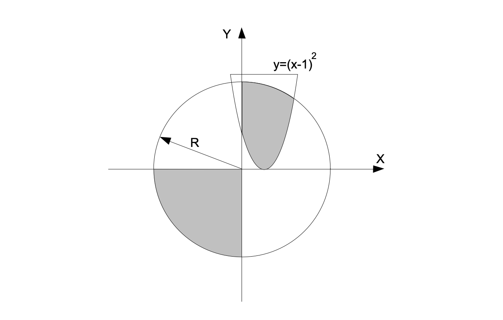

# Лабораторна робота № 3.4

### Автор: Кулаковський Юрій

### Варіант: 9

## Опис

Ця програма визначає, чи знаходиться точка з координатами \(x, y\) всередині або на межі плоскої фігури зображеної на рисунку. Фігура складається з параболи та кола, обмежених умовами, які залежать від радіусу \(R\).

## Структура програми

1. **Вхідні дані**:
    - Користувач вводить значення змінних \(x\), \(y\) та радіус \(R\).

2. **Логіка програми**:
    - Якщо точка з координатами \(x, y\) задовольняє наступні умови:
        - Для \(y \leq 0\): точка знаходиться під параболою \(y = (x - 1)^2\), і \(|y| \leq R\), причому \(x \leq 0\).
        - Для \(y \geq 0\): точка знаходиться над параболою \(y = (x - 1)^2\), і \(|y| \leq R\), причому \(x \geq 0\).

    - Якщо умови виконуються, програма виводить "yes", інакше — "no".

3. **Виведення результату**:
    - Програма виводить "yes", якщо точка знаходиться всередині або на межі фігури, і "no" — якщо за межами.

## Приклад виконання

x = 0 

y = -1 

R = 2 

yes

x = 1 

y = 3 

R = 2 

no

## **Використовувані бібліотеки**

`<iostream>` — для введення та виведення даних.  

`<cmath>` — для математичних обчислень, таких як піднесення до квадрату.